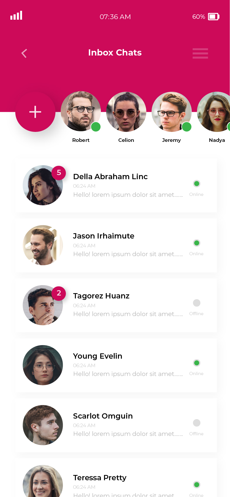
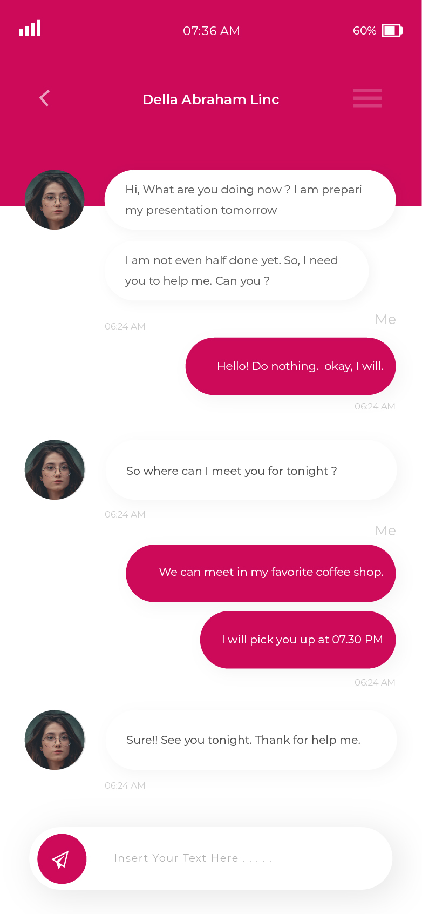

# flutter_ui_15_chat_ui_3

This is another chat app UI which i made in flutter
**About the UI** 
This UI has only two screens. When you will open the app the first UI will load up where you have the names photos and chats of people available whom you have a chat with in the past. In the top there is a story swipe section where you can scroll through list items and have a look at the stories which are still available. 
When you click on any of the chat items the chat with the respective item clicked will open. The UI for this is mostly similar to the previous page. We have a stack on which we have aligned multiple widgets. The chat is made wth the help of list view. The bottom text field look alike section is made with container stacked on the list view.
___
Built in:-
* Flutter

___
Some Snaps from the app:-
* Full video:- 
* Snaps

## Getting Started

This project is a starting point for a Flutter application.

A few resources to get you started if this is your first Flutter project:

- [Lab: Write your first Flutter app](https://flutter.dev/docs/get-started/codelab)
- [Cookbook: Useful Flutter samples](https://flutter.dev/docs/cookbook)

For help getting started with Flutter, view our
[online documentation](https://flutter.dev/docs), which offers tutorials,
samples, guidance on mobile development, and a full API reference.
